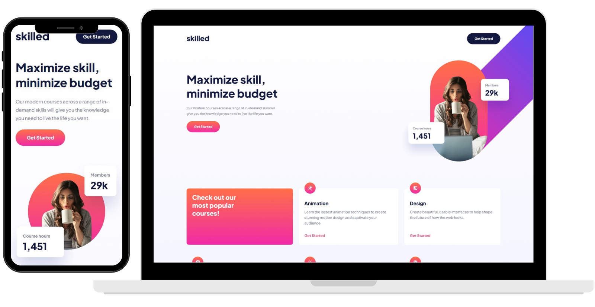

# Welcome to Skilled E-Learning

## About this proyect

It is a challenge proyect supplied by <a href="https://www.frontendmentor.io/profile/SantiNakc">Frontend Mentor</a>

## What did I do?

- I used Sass to make this proyect
- A little bit of grid
- A little bit of transform to put the header img on place
- I made it responsive

It was an easy layout to practice some grid and flex.
